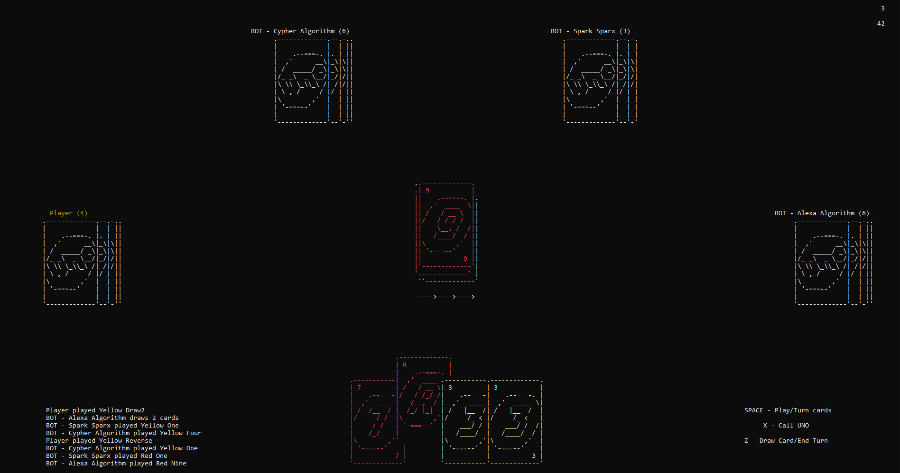

**NOTE:** Luumie is added via Git submodules. Use `--recursive` when cloning the repository.

### UNO - Luumie example
Classical single player UNO for the windows console using [Luumie game engine](https://github.com/kktsnn/Luumie.git).

